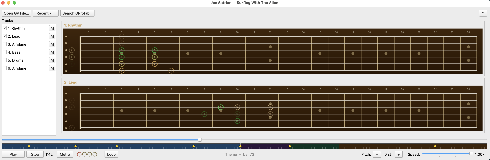

# Fretboard



A Guitar Pro file player, fretboard visualiser and segment looper.

## Features

### Playback
- Play, pause, stop, and seek through Guitar Pro files (`.gp3`, `.gp4`, `.gp5`, `.gpx`, `.gp`)
- Speed control (25%–100%)
- Pitch shift (±24 semitones)
- Metronome with audio clicks (accented downbeat) and visual beat indicator matching the file's time signature
- Reopens the last used file on startup

### Fretboard display
- One fretboard per enabled track, stacked vertically
- Active notes highlighted with technique-specific visuals:
  - **Normal** — red filled dot
  - **Palm mute** — brown dot labelled `PM`
  - **Hammer-on / pull-off** — hollow red ring
  - **Dead note** — grey hollow circle with `x`
  - **Bend** — arrow showing bend direction and amount
  - **Slide** — angled line into/out of the note
  - **Vibrato** — `~` marker above the dot
- Context window shows upcoming and recently played notes as faded circles — green for upcoming, amber for past, dimming with distance from the playhead

### Audio
- Additive sine synthesis with per-note bend, slide, and vibrato baked in via phase accumulation
- Dead notes play a short percussive thud
- Per-track mute (silences audio while keeping fretboard visuals active)

### Loop segments
- Loop bar below the seek slider — split the song into segments for focused practice
- Markers snap to bar boundaries; minimum segment size is 1 bar
- **Loop** button enables looping of the selected segment
- Section markers from the GP file (Intro, Chorus, Solo, etc.) shown as yellow dots; hover shows the section name
- Current bar number and section name displayed continuously in the controls bar
- Per-file loop state (markers, active segment, enabled) saved across sessions

### Keyboard shortcuts

| Key | Action |
|-----|--------|
| `Space` | Play / Pause |
| `L` | Toggle loop |
| `M` | Toggle metronome |
| `← →` | Move one bar back / forward |
| `↑ ↓` | Next / previous segment |
| `⌘ ← →` | Move marker at playhead one bar, or create one |
| `D` | Delete marker at playhead |
| Double-click bar | Add marker at that bar |
| Double-click marker | Remove marker |

Press **?** in the toolbar to show this reference in-app.

### File management
- Recent files menu (last 5 opened)
- Per-file state saved across sessions: playback position, enabled tracks, muted tracks, pitch offset, speed, and loop markers

### GProTab search

Built-in search dialog connects to [gprotab.net](https://gprotab.net):

- Search by artist or song name
- Results grouped by song, multiple versions collapsed under one entry
- Click a group to expand; click a tab to fetch its rating
- Double-click or press **Download && Open** to download and play immediately

## Installation

### Prerequisites

- Python 3.11+
- [uv](https://github.com/astral-sh/uv) — fast Python package runner

Install `uv` if you don't have it:

```bash
curl -LsSf https://astral.sh/uv/install.sh | sh
```

On macOS with Homebrew:

```bash
brew install uv
```

### Get the app

```bash
git clone https://github.com/vahana/fretboard.git
cd fretboard
chmod +x fretboard.py
```

No virtualenv or `pip install` needed — `uv` resolves and caches dependencies automatically on first run.

## Running

```bash
./fretboard.py                   # launches the app
./fretboard.py path/to/song.gp5  # launches the app and opens the file directly
```

On macOS you can also double-click `fretboard.py` in Finder if your system associates `.py` files with `uv`.

## Supported formats

`.gp3`, `.gp4`, `.gp5`, `.gpx`, `.gp`
